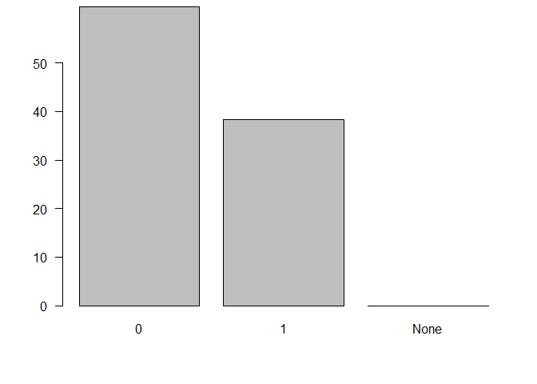
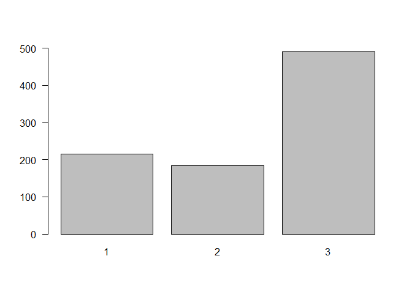
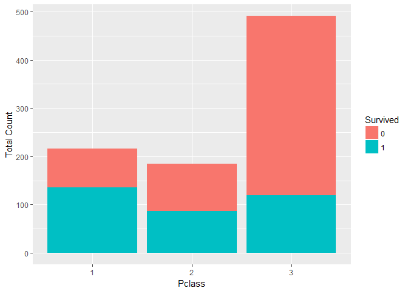
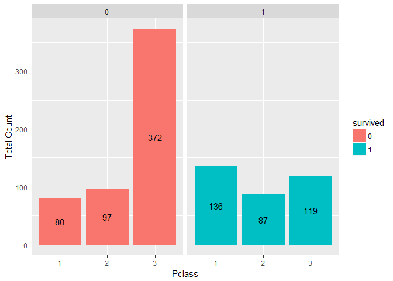

TITANIC MACHINE LEARNING REPORTING
================
Daouda Tandiang DJIBA

Data Analysis from Titanic disaster
===================================

Description of the data:
------------------------

Train dataset: Variables Names, types and summary on the train dataset:

    ##  [1] "survived" "pclass"   "name"     "sex"      "age"      "sibsp"   
    ##  [7] "parch"    "ticket"   "fare"     "cabin"    "embarked"

    ## 'data.frame':    891 obs. of  11 variables:
    ##  $ survived: int  0 1 1 1 0 0 0 0 1 1 ...
    ##  $ pclass  : int  3 1 3 1 3 3 1 3 3 2 ...
    ##  $ name    : Factor w/ 891 levels "Abbing, Mr. Anthony",..: 109 191 358 277 16 559 520 629 417 581 ...
    ##  $ sex     : Factor w/ 2 levels "female","male": 2 1 1 1 2 2 2 2 1 1 ...
    ##  $ age     : num  22 38 26 35 35 NA 54 2 27 14 ...
    ##  $ sibsp   : int  1 1 0 1 0 0 0 3 0 1 ...
    ##  $ parch   : int  0 0 0 0 0 0 0 1 2 0 ...
    ##  $ ticket  : Factor w/ 681 levels "110152","110413",..: 524 597 670 50 473 276 86 396 345 133 ...
    ##  $ fare    : num  7.25 71.28 7.92 53.1 8.05 ...
    ##  $ cabin   : Factor w/ 148 levels "","A10","A14",..: 1 83 1 57 1 1 131 1 1 1 ...
    ##  $ embarked: Factor w/ 4 levels "","C","Q","S": 4 2 4 4 4 3 4 4 4 2 ...

    ##     survived          pclass     
    ##  Min.   :0.0000   Min.   :1.000  
    ##  1st Qu.:0.0000   1st Qu.:2.000  
    ##  Median :0.0000   Median :3.000  
    ##  Mean   :0.3838   Mean   :2.309  
    ##  3rd Qu.:1.0000   3rd Qu.:3.000  
    ##  Max.   :1.0000   Max.   :3.000  
    ##                                  
    ##                                     name         sex           age       
    ##  Abbing, Mr. Anthony                  :  1   female:314   Min.   : 0.42  
    ##  Abbott, Mr. Rossmore Edward          :  1   male  :577   1st Qu.:20.12  
    ##  Abbott, Mrs. Stanton (Rosa Hunt)     :  1                Median :28.00  
    ##  Abelson, Mr. Samuel                  :  1                Mean   :29.70  
    ##  Abelson, Mrs. Samuel (Hannah Wizosky):  1                3rd Qu.:38.00  
    ##  Adahl, Mr. Mauritz Nils Martin       :  1                Max.   :80.00  
    ##  (Other)                              :885                NA's   :177    
    ##      sibsp           parch             ticket         fare       
    ##  Min.   :0.000   Min.   :0.0000   1601    :  7   Min.   :  0.00  
    ##  1st Qu.:0.000   1st Qu.:0.0000   347082  :  7   1st Qu.:  7.91  
    ##  Median :0.000   Median :0.0000   CA. 2343:  7   Median : 14.45  
    ##  Mean   :0.523   Mean   :0.3816   3101295 :  6   Mean   : 32.20  
    ##  3rd Qu.:1.000   3rd Qu.:0.0000   347088  :  6   3rd Qu.: 31.00  
    ##  Max.   :8.000   Max.   :6.0000   CA 2144 :  6   Max.   :512.33  
    ##                                   (Other) :852                   
    ##          cabin     embarked
    ##             :687    :  2   
    ##  B96 B98    :  4   C:168   
    ##  C23 C25 C27:  4   Q: 77   
    ##  G6         :  4   S:644   
    ##  C22 C26    :  3           
    ##  D          :  3           
    ##  (Other)    :186

Test dataset: Variables Names, types and summary on the train dataset:

    ##  [1] "pclass"   "name"     "sex"      "age"      "sibsp"    "parch"   
    ##  [7] "ticket"   "fare"     "cabin"    "embarked"

    ## 'data.frame':    418 obs. of  10 variables:
    ##  $ pclass  : int  3 3 2 3 3 3 3 2 3 3 ...
    ##  $ name    : Factor w/ 418 levels "Abbott, Master. Eugene Joseph",..: 210 409 273 414 182 370 85 58 5 104 ...
    ##  $ sex     : Factor w/ 2 levels "female","male": 2 1 2 2 1 2 1 2 1 2 ...
    ##  $ age     : num  34.5 47 62 27 22 14 30 26 18 21 ...
    ##  $ sibsp   : int  0 1 0 0 1 0 0 1 0 2 ...
    ##  $ parch   : int  0 0 0 0 1 0 0 1 0 0 ...
    ##  $ ticket  : Factor w/ 363 levels "110469","110489",..: 153 222 74 148 139 262 159 85 101 270 ...
    ##  $ fare    : num  7.83 7 9.69 8.66 12.29 ...
    ##  $ cabin   : Factor w/ 77 levels "","A11","A18",..: 1 1 1 1 1 1 1 1 1 1 ...
    ##  $ embarked: Factor w/ 3 levels "C","Q","S": 2 3 2 3 3 3 2 3 1 3 ...

    ##      pclass                                             name    
    ##  Min.   :1.000   Abbott, Master. Eugene Joseph            :  1  
    ##  1st Qu.:1.000   Abelseth, Miss. Karen Marie              :  1  
    ##  Median :3.000   Abelseth, Mr. Olaus Jorgensen            :  1  
    ##  Mean   :2.266   Abrahamsson, Mr. Abraham August Johannes :  1  
    ##  3rd Qu.:3.000   Abrahim, Mrs. Joseph (Sophie Halaut Easu):  1  
    ##  Max.   :3.000   Aks, Master. Philip Frank                :  1  
    ##                  (Other)                                  :412  
    ##      sex           age            sibsp            parch       
    ##  female:152   Min.   : 0.17   Min.   :0.0000   Min.   :0.0000  
    ##  male  :266   1st Qu.:21.00   1st Qu.:0.0000   1st Qu.:0.0000  
    ##               Median :27.00   Median :0.0000   Median :0.0000  
    ##               Mean   :30.27   Mean   :0.4474   Mean   :0.3923  
    ##               3rd Qu.:39.00   3rd Qu.:1.0000   3rd Qu.:0.0000  
    ##               Max.   :76.00   Max.   :8.0000   Max.   :9.0000  
    ##               NA's   :86                                       
    ##       ticket         fare                     cabin     embarked
    ##  PC 17608:  5   Min.   :  0.000                  :327   C:102   
    ##  113503  :  4   1st Qu.:  7.896   B57 B59 B63 B66:  3   Q: 46   
    ##  CA. 2343:  4   Median : 14.454   A34            :  2   S:270   
    ##  16966   :  3   Mean   : 35.627   B45            :  2           
    ##  220845  :  3   3rd Qu.: 31.500   C101           :  2           
    ##  347077  :  3   Max.   :512.329   C116           :  2           
    ##  (Other) :396   NA's   :1         (Other)        : 80

To avoid duplicate data work, let's combine the train dataset and the test dataset to a dataframe called data.combined.

To do this, let's first add the "survived" variable to the Test dataset.

``` r
test.survived <- data.frame(survived = rep("None", nrow(test)), test[,])
str(test.survived)
```

    ## 'data.frame':    418 obs. of  11 variables:
    ##  $ survived: Factor w/ 1 level "None": 1 1 1 1 1 1 1 1 1 1 ...
    ##  $ pclass  : int  3 3 2 3 3 3 3 2 3 3 ...
    ##  $ name    : Factor w/ 418 levels "Abbott, Master. Eugene Joseph",..: 210 409 273 414 182 370 85 58 5 104 ...
    ##  $ sex     : Factor w/ 2 levels "female","male": 2 1 2 2 1 2 1 2 1 2 ...
    ##  $ age     : num  34.5 47 62 27 22 14 30 26 18 21 ...
    ##  $ sibsp   : int  0 1 0 0 1 0 0 1 0 2 ...
    ##  $ parch   : int  0 0 0 0 1 0 0 1 0 0 ...
    ##  $ ticket  : Factor w/ 363 levels "110469","110489",..: 153 222 74 148 139 262 159 85 101 270 ...
    ##  $ fare    : num  7.83 7 9.69 8.66 12.29 ...
    ##  $ cabin   : Factor w/ 77 levels "","A11","A18",..: 1 1 1 1 1 1 1 1 1 1 ...
    ##  $ embarked: Factor w/ 3 levels "C","Q","S": 2 3 2 3 3 3 2 3 1 3 ...

Combine data sets

``` r
data.combined <- rbind(train, test.survived)
str(data.combined)
```

    ## 'data.frame':    1309 obs. of  11 variables:
    ##  $ survived: chr  "0" "1" "1" "1" ...
    ##  $ pclass  : int  3 1 3 1 3 3 1 3 3 2 ...
    ##  $ name    : Factor w/ 1307 levels "Abbing, Mr. Anthony",..: 109 191 358 277 16 559 520 629 417 581 ...
    ##  $ sex     : Factor w/ 2 levels "female","male": 2 1 1 1 2 2 2 2 1 1 ...
    ##  $ age     : num  22 38 26 35 35 NA 54 2 27 14 ...
    ##  $ sibsp   : int  1 1 0 1 0 0 0 3 0 1 ...
    ##  $ parch   : int  0 0 0 0 0 0 0 1 2 0 ...
    ##  $ ticket  : Factor w/ 929 levels "110152","110413",..: 524 597 670 50 473 276 86 396 345 133 ...
    ##  $ fare    : num  7.25 71.28 7.92 53.1 8.05 ...
    ##  $ cabin   : Factor w/ 187 levels "","A10","A14",..: 1 83 1 57 1 1 131 1 1 1 ...
    ##  $ embarked: Factor w/ 4 levels "","C","Q","S": 4 2 4 4 4 3 4 4 4 2 ...

Let's Transform the "Pclass" and the "Survived" variables to factor for analysis:

``` r
data.combined$survived <- as.factor(data.combined$survived)
data.combined$pclass <- as.factor(data.combined$pclass)
str(data.combined)
```

    ## 'data.frame':    1309 obs. of  11 variables:
    ##  $ survived: Factor w/ 3 levels "0","1","None": 1 2 2 2 1 1 1 1 2 2 ...
    ##  $ pclass  : Factor w/ 3 levels "1","2","3": 3 1 3 1 3 3 1 3 3 2 ...
    ##  $ name    : Factor w/ 1307 levels "Abbing, Mr. Anthony",..: 109 191 358 277 16 559 520 629 417 581 ...
    ##  $ sex     : Factor w/ 2 levels "female","male": 2 1 1 1 2 2 2 2 1 1 ...
    ##  $ age     : num  22 38 26 35 35 NA 54 2 27 14 ...
    ##  $ sibsp   : int  1 1 0 1 0 0 0 3 0 1 ...
    ##  $ parch   : int  0 0 0 0 0 0 0 1 2 0 ...
    ##  $ ticket  : Factor w/ 929 levels "110152","110413",..: 524 597 670 50 473 276 86 396 345 133 ...
    ##  $ fare    : num  7.25 71.28 7.92 53.1 8.05 ...
    ##  $ cabin   : Factor w/ 187 levels "","A10","A14",..: 1 83 1 57 1 1 131 1 1 1 ...
    ##  $ embarked: Factor w/ 4 levels "","C","Q","S": 4 2 4 4 4 3 4 4 4 2 ...

Workforce distribution for some variables
-----------------------------------------

-   "Survived" variable:

Proportions for the first 891 rows (Train dataset)

``` r
prop.table(table(data.combined$survived [1:891])) * 100
```

    ## 
    ##        0        1     None 
    ## 61.61616 38.38384  0.00000

``` r
barplot(prop.table(table(data.combined$survived [1:891])) * 100, ylim=c(0,50), las=1 )
```



61.61 % passengers perished

38.38 % passengers survived

-   "Pclass" variable

Distribution across classes for the first 891 rows (Train dataset)

``` r
table(data.combined$pclass[1:891])
```

    ## 
    ##   1   2   3 
    ## 216 184 491

``` r
barplot(table(data.combined$pclass[1:891]), ylim=c(0, 500),las=1)
```



216 passengers in the first class

184 passengers in the second class

491 passengers in the third class

Let's take a look to the survival rate distribution in classes

### Hypothesis: Rich passengers survived at a higher rate

Distrution of the "survived" variable in classes

``` r
library(ggplot2)
library(scales)  # for percentage scales
ggplot(data.combined[1:891,], aes(x = pclass, fill = factor(survived))) +
  geom_bar() +
  xlab("Pclass") +
  ylab("Total Count") +
  labs(fill = "Survived") 
```



``` r
ggplot(data.combined[1:891,], aes(x = pclass, fill = survived )) +
geom_bar(aes(y = ..count..))+
geom_text(aes(label = ..count.., y = ..count..), stat="count", position = position_stack(vjust = 0.5)) +
xlab("Pclass") + 
ylab("Total Count") + 
labs(fill = "survived") +
facet_grid(~survived)
```


